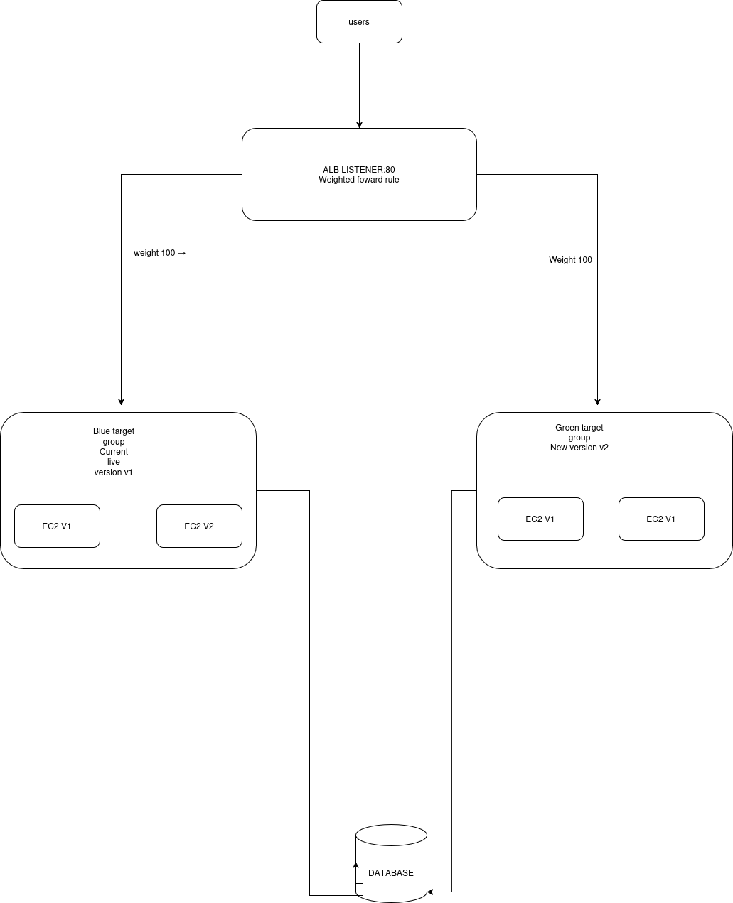

# Blue-Green Deployment on AWS — Zero-Downtime Web-Tier Releases

**Author:** Esther Wakukha
**Date:** July 5, 2026 | **Region:** us-east-1
**Repository:** https://github.com/essiewakukha/aws-blue-green-deployment

## Scenario

A Nairobi-based telecommunications provider runs a three-tier web application (ALB + EC2 web tier, app tier, Amazon RDS MySQL data tier). The CTO requires zero-downtime deployments for web-tier updates, with gradual traffic switching and automated rollback if the new version fails. This project designs, implements, and demonstrates that capability end to end — including a deliberately induced production failure that the automation detects and recovers from **without human intervention, in under 300 ms of execution time**.

---

## 1. Architecture

### Design

Two fully separate web-tier environments run behind a single Application Load Balancer. The ALB listener uses a **weighted forward rule** across two target groups; shifting traffic is an atomic control-plane operation on the weights, requiring no DNS changes, no instance restarts, and no dropped connections.

```
Users → ALB listener :80 (weighted forward rule)
          ├── weight W_blue  → tg-blue  → EC2 v1 × 2 (current production)
          └── weight W_green → tg-green → EC2 v2 × 2 (new release)

CloudWatch alarms on Green (5xx count, latency, unhealthy hosts)
   → EventBridge rule (state = ALARM)
      → Lambda rollback function
         → elbv2 modify-listener: Blue=100 / Green=0   [automated rollback]
```



| Component | Blue (current) | Green (new) |
|---|---|---|
| EC2 instances | 2 × t3.micro, app v1.0 | 2 × t3.micro, app v2.0 |
| Target group | `bluegreen-capstone-tg-blue` | `bluegreen-capstone-tg-green` |
| AMI | Amazon Linux 2023 (identical) | Amazon Linux 2023 (identical) |
| Security group | `bluegreen-capstone-app-sg` (shared) | `bluegreen-capstone-app-sg` (shared) |
| Health check | GET /health → 200, 10 s interval | GET /health → 200, 10 s interval |

**Environment parity by construction.** Both environments are launched by the *same* script (`launch-env.sh`) taking `blue|green` as its only argument; AMI, instance type, subnet, and security group are shared code paths, so configuration drift between environments is structurally impossible — the only difference is the user-data (application version). The shared app security group admits port 80 **only from the ALB security group**, never from the internet (evidence: `docs/evidence/07-app-sg-alb-only.png`).

**Infrastructure as code.** All static infrastructure — both security groups, both target groups, the ALB, the weighted listener, three CloudWatch alarms, the rollback Lambda (code inline), the EventBridge rule, and IAM roles — is defined in a single CloudFormation template (`infra/infra.yml`, 13 resources) and deployed with one command. Deployment *actions* (launching an environment, gating on tests, shifting weights, rolling back) remain imperative scripts: declarative IaC for state, imperative control for procedures. Evidence: `docs/logs/01-stack-resources.log`, `docs/evidence/01-stack-resources.png`.

**Data-tier note.** Blue and Green share the single RDS MySQL data tier by design; duplicating the database would break data consistency during a gradual traffic split. This imposes a release discipline: v2 must remain backward-compatible with the live schema (expand-then-contract migrations). The data tier is out of scope for web-tier switching per the brief.

---

## 2. Deployment procedure and validation

### Planned steps

| # | Step | Command | Gate / success criterion |
|---|---|---|---|
| 1 | Deploy static infrastructure | `./deploy-stack.sh` | Stack CREATE_COMPLETE; listener at Blue=100/Green=0 |
| 2 | Launch Blue (v1) | `./launch-env.sh blue` | Both targets healthy in tg-blue |
| 3 | Launch Green (v2) | `./launch-env.sh green` | Both targets healthy in tg-green — **still 0% traffic** |
| 4 | Validate Green | health checks + content verification | All Green targets healthy *before any traffic shift* |
| 5 | Canary | `./switch-traffic.sh 10` | Sampler ≈ 90/10; alarms remain OK |
| 6 | Ramp | `./switch-traffic.sh 50` | Sampler ≈ 50/50; alarms remain OK |
| 7 | Cutover | `./switch-traffic.sh 100` | Sampler 0/100; alarms remain OK |
| 8 | Failure demonstration | deploy broken v2.1 + load | Alarm → ALARM → automated rollback to Blue |

### Validation before traffic shift

Green was deployed and fully validated while receiving **zero production traffic** (listener weight 0). Validation relied on two version-specific signals:

1. **ALB target health** — both Green instances passed GET `/health` → 200 checks (`docs/logs/04-tg-green-health.log`, `docs/evidence/04-tg-green-healthy.png`).
2. **Version verification via health-check content** — Blue's `/health` returns `OK - blue v1` and Green's returns `OK - green v2`; the 200 responses the ALB accepted from Green can only be produced by the v2 configuration, so target health doubles as deployment verification.

Throughout Green's entire launch and validation, the production URL continued serving the Blue v1 page (`docs/evidence/09-browser-blue-live.png`) — the zero-impact property of the pattern.

---

## 3. Traffic switching and monitoring

### Monitoring configuration

Three CloudWatch alarms watch the Green target group (defined in `infra.yml`):

| Alarm | Metric | Threshold | Purpose |
|---|---|---|---|
| `green-5xx-errors` | HTTPCode_Target_5XX_Count (Sum) | ≥ 5 in 60 s | Application failures reaching users |
| `green-high-latency` | TargetResponseTime (Avg) | > 1 s for 2 × 60 s | Performance regressions that don't error |
| `green-unhealthy-hosts` | UnHealthyHostCount (Max) | ≥ 1 in 60 s | Crashed or hung instances |

All alarms use `TreatMissingData: notBreaching` so Green idling at weight 0 (zero requests → zero datapoints) does not false-alarm. Live metrics watched during the switch: `RequestCount` per target group (proves traffic actually moved), 5xx count, response time, and healthy-host counts.

### Observed traffic migration (measured)

Traffic was shifted gradually via listener weight changes, with each stage verified by sampling live requests through the ALB and confirming all alarms remained OK before proceeding:

| Stage | Weights set | Weight change applied in | Sampled requests observed | Alarms |
|---|---|---|---|---|
| Baseline | Blue 100 / Green 0 | 712 ms | 20/20 Blue | OK |
| Canary | Blue 90 / Green 10 | 655 ms | ≈ 90% / 10% split | OK |
| Ramp | Blue 50 / Green 50 | ~700 ms | **10/20 Blue : 10/20 Green** | OK |
| Cutover | Blue 0 / Green 100 | 723 ms | **0/20 Blue : 20/20 Green** | OK |

Evidence: `docs/logs/15-ramp-50.log`, `docs/evidence/14-canary-10.png`, `15-ramp-50.png`, `16-cutover-100.png`.

**Propagation finding.** The first sampling runs measured the *previous* weight state: `modify-listener` returns when the control plane accepts the change, but propagation across the ALB's nodes takes several seconds. The switch script was amended with a 15-second settle window before sampling. Lesson: an API call succeeding is not the same as the change being in effect — verify behavior, not just configuration.

---

## 4. Failure handling and rollback (incident report)

### Rollback design

Two independent paths, both reverting the listener to Blue=100/Green=0:

- **Manual:** `./switch-traffic.sh 0` — a single command; measured completion **640 ms** (`docs/logs/06-manual-revert-timing.log`).
- **Automated:** CloudWatch alarm (ALARM) → EventBridge rule → Lambda → `elbv2:ModifyListener`. The Lambda is idempotent and logs every invocation, providing an audit trail.

Rollback is a sub-second re-weight *only because* Blue's instances remain running, healthy, and registered throughout the deployment window — the deliberate cost of the blue-green pattern (double compute during deployment, in exchange for instant reversibility).

### The demonstrated incident (July 5, 2026, times UTC)

A realistic failure was engineered: a "v2.1" release whose `/health` endpoint still returns 200 (so it passes all deployment health checks) but whose application pages return HTTP 500 — the classic failure mode that health checks alone cannot catch, and precisely what the 5xx alarm exists for.

| Time | Event |
|---|---|
| ~20:09 | Broken v2.1 deployed to Green; targets report **healthy** (the trap works) |
| 20:12:25 | **First automated rollback** — `green-unhealthy-hosts` alarm tripped by the terminate-and-replace of Green instances during deployment; Lambda reverted weights defensively |
| ~20:12–20:15 | 347 requests generated through the ALB (~115 errors/min against a threshold of 5/min) |
| 20:15:24 | `green-5xx-errors` → **ALARM**; EventBridge fires the Lambda |
| 20:15:24.702 | **`ROLLBACK COMPLETE - all traffic on Blue.`** — Lambda execution **293 ms**, zero human intervention |

Lambda log excerpt (`docs/logs/18-lambda-rollback.log`):

```
20:15:24  Triggered by alarm=bluegreen-capstone-green-5xx-errors state=ALARM
20:15:24  Rolling back: setting Blue=100 / Green=0 ...
20:15:24  ROLLBACK COMPLETE - all traffic on Blue.
REPORT    Duration: 293.20 ms   Memory: 91 MB / 128 MB
```

Post-incident state: listener auto-reverted to Blue=100/Green=0 (`docs/logs/19-weights-auto-reverted.log`), users receiving the Blue v1 page again (`docs/evidence/11-browser-blue-after-rollback.png`), alarm timeline in `docs/logs/20-alarm-timeline.log` and `docs/evidence/06-5xx-alarm-graph.png`.

### Failure scenarios covered

| Scenario | Detection | Response |
|---|---|---|
| Green serves 5xx under load | 5xx alarm (≤ ~2 min) | Automated rollback — **demonstrated** |
| Green slow but not erroring | Latency alarm | Automated rollback |
| Green instance crashes | Unhealthy-host alarm; ALB also stops routing to that target | Automated rollback — **demonstrated** (20:12 trigger) |
| Bad deploy caught pre-switch | Target health / smoke gate fails | Traffic never shifted |
| Automation itself fails | Lambda errors visible in CloudWatch Logs | Manual `./switch-traffic.sh 0` (640 ms) remains available |

---

## 5. Planned vs observed behavior

| Event | Planned | Observed |
|---|---|---|
| Instance bootstrap | nginx installed via user-data on first boot | **Failed twice before succeeding** — see lessons 1 and 2 |
| Traffic shift mechanism | Weighted listener, gradual | First attempt was an all-at-once cutover via target-group replacement; corrected to weighted 10→50→100 (lesson 4) |
| Weight change latency | "fast" | Measured 640–723 ms per change |
| Sampler at each stage | Matches set weights | Matched **after** adding a 15 s propagation settle (lesson 3) |
| Failure detection | 5xx alarm within ~2 min of errors | Confirmed; additionally, the unhealthy-hosts alarm fired *earlier*, during the deployment itself (lesson 5) |
| Automated recovery | Traffic reverted without intervention | Confirmed — 293 ms Lambda execution, weights verified reverted |

---

## 6. Lessons learned

1. **An instance can be "running" with no application on it.** Both initial Blue instances failed health checks because they launched with empty user-data. Diagnosis came from the EC2 console log: cloud-init's `modules:final` phase (where user-data executes) completed in **0.2 seconds** — nginx installation takes 20–60 s and prints package output, so its absence proved the bootstrap never ran. Fix: recreate the user-data files and replace the instances (user-data only executes on first boot).
2. **The same symptom, different root causes — read `TargetHealth.Reason`.** The second failure round showed `Target.ResponseCodeMismatch` instead of connection failures: nginx was up but `/health` returned 404 because the distro's default config didn't include our drop-in directory. Distinguishing *connection refused* (nothing listening) from *wrong response code* (listening, misconfigured) directed the fix — an explicit full nginx.conf rather than an include-dependent snippet.
3. **API success ≠ change in effect.** `modify-listener` returns before the new weights propagate to all ALB nodes; immediate sampling measured the previous state. Verification must observe *behavior* after a settle window, not just read back configuration.
4. **Weighted forwarding beats target-group replacement.** An early switch script replaced the listener's target group outright — an all-at-once cutover that removed Blue from the listener, making rollback a re-attach operation instead of a re-weight, and skipping the gradual canary the brief requires. Keeping both target groups permanently attached with adjustable weights makes switching and rollback the same trivial sub-second operation.
5. **Deployment operations can trip protective automation.** Terminating Green's registered instances (to deploy v2.1) looked identical to an outage from the unhealthy-hosts alarm's perspective, triggering a defensive rollback at 20:12 — three minutes before the "real" incident. In production: deregister targets before terminating, or suspend the rollback rule during controlled replacement at weight 0. Positively framed: two independent detection layers each proved capable of triggering recovery.
6. **Content-based verification must account for error responses.** After the failure demo, a 50/50 sampler read 20/20 Blue — because the broken Green returned 500 bodies lacking the "GREEN" version marker, so its responses were miscounted as Blue. Version-marker checks need to be paired with status-code checks, or they silently misreport exactly when it matters most.
7. **The cost of instant reversibility is a doubled fleet.** Four instances ran throughout the deployment window (2 Blue + 2 Green). That is the blue-green trade-off: rolling updates use no extra capacity but cannot revert in under a second; blue-green pays double compute temporarily so that rollback never requires a boot cycle (~4–5 minutes of exposure, as experienced repeatedly during debugging).

---

## 7. Repository structure

```
aws-blue-green-deployment/
├── README.md                     this report
├── infra/
│   └── infra.yml                 CloudFormation: SGs, TGs, ALB, weighted listener,
│                                 3 alarms, rollback Lambda (inline), EventBridge, IAM
├── scripts/
│   ├── env.sh                    shared config; auto-synced from stack outputs
│   ├── deploy-stack.sh           deploy/update the CloudFormation stack
│   ├── launch-env.sh             launch blue|green EC2 + register with target group
│   ├── smoke-test.sh             pre-switch validation gate
│   ├── switch-traffic.sh         weighted shift (0-100) + propagation wait + live sampling
│   ├── rollback.sh               manual emergency revert to Blue=100
│   ├── simulate-failure.sh       failure-demo helper
│   └── cleanup.sh                teardown
├── userdata/
│   ├── blue-v1.sh                v1 app (blue page + /health)
│   ├── green-v2.sh               v2 app (green page + /health)
│   └── green-v2-broken.sh        the faulty "v2.1" used for the rollback demonstration
└── docs/
    ├── evidence/                 screenshots (numbered, referenced above)
    └── logs/                     raw command-output logs (numbered, referenced above)
```

## 8. How to reproduce

Prerequisites: AWS CLI v2 with permissions for CloudFormation, EC2, ELBv2, CloudWatch, EventBridge, Lambda, and IAM (CloudShell recommended).

```
cd scripts && chmod +x *.sh
./deploy-stack.sh                 # ~3-4 min; prints the ALB URL
./launch-env.sh blue              # wait ~2 min for healthy targets
./launch-env.sh green             # deploys v2 at 0% traffic
./switch-traffic.sh 10            # canary  — verify sampler + alarms OK
./switch-traffic.sh 50            # ramp
./switch-traffic.sh 100           # cutover
```

Failure demonstration: deploy `userdata/green-v2-broken.sh` as Green, generate load through the ALB URL for ~3 minutes, and watch the 5xx alarm trigger the automated rollback (Lambda logs: `aws logs tail /aws/lambda/bluegreen-capstone-auto-rollback`).

Teardown:

```
aws ec2 terminate-instances --instance-ids <all blue+green ids>
aws cloudformation delete-stack --stack-name bluegreen-capstone-infra-stack
```

## 9. Post-deployment lifecycle

Once Green proves stable in production for an agreed soak period, Blue is decommissioned (or retained as the standby for the next release, with environments swapping roles). Each release's user-data is version-controlled and tagged, so any environment is exactly reproducible. In a production setting the next evaluation step would be a managed pipeline (CodeDeploy or ECS blue/green); for EC2, CodeDeploy supports only all-at-once traffic rerouting, so the weighted ALB listener was chosen to satisfy the gradual-shift requirement.